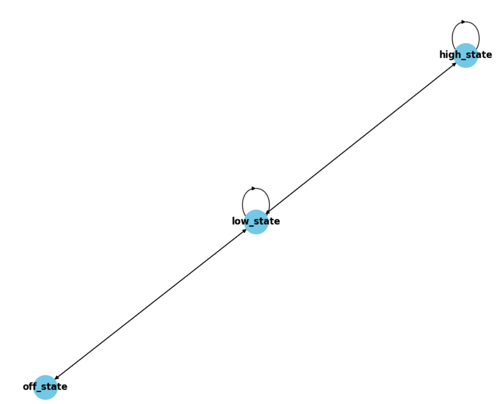

# SimpleFSM

This is the code for the SimpleFSM framework, which is a framework for facilitating creating Finite State Machines. Below are some instructions 
on use and how to install the package. Thank you for the opportunity to work on it. 

*Jonathan Thompson* 

## Installation 
This project is built using `poetry`. As such the recommended way would be to run the command `poetry install` in the root directory. This will install all dependencies, such as testing dependencies.  

If one prefers to use pip or conda (by way of pip), one can also use `poetry` to build a tar.gz file with the command `poetry build` and this should be pip installable. This tar.gz file should located in the */dist* directory.

## Usage 
The framework consists of 3 main components: *State*, *state_action*, *state_transition*, and *FSM*. We will explain each of these. 

Each of these should be imported from the `SimpleFSM` package. 

### State
The State class is what a user defines for each state node in the desired FSM. Generally the user will only create instances of this class as class variables in classes that extend the *FSM* class. Each State obeject will have associated with it: an action and a transition. These will be discussed below in the *FSM* section. Lastly, a user will create State objects with the constructor command: 
```python
State("low_state", is_start=True)
```
The first argument is the name of the State node. This name must be unique and it will be used for state actions and state transitions. The other named argument is if this state object is the starting node. Only one node can be the starting node. 

### FSM 
To create a finite state machine, you need to create a class that extends *FSM*.

```python
class MyFSM(FSM):
    low_st = State("low_state", is_start=True)
    high_st = State("high_state")
    off_st = State("off_state")
```

A user also adds each state node as a class attributes and needs to only give each a unique name and specify which is the starting node. 

### state_action
To define an action for a State, a user uses the *state_action* decorator after the *staticmethod* decorator.

```python
class MyFSM(FSM):
    low_st = State("low_state", is_start=True)
    high_st = State("high_state")
    off_st = State("off_state")

    @staticmethod
    @state_action("low_state") 
    def low_st_action(event_item, context_data):
        if context_data['heat'] >= 100:
            send_elevated_heat_alert()
        else:
            send_heartbeat_check()

    @staticmethod
    @state_action("high_state") 
    def low_st_action(event_item, context_data):
        if context_data['heat'] >= 200:
            send_high_heat_alert()
        else:
            send_diagnostics()
            send_heartbeat_check()
    
    @staticmethod
    @state_action("off_state") 
    def low_st_action(event_item, context_data):
        # state is off
        pass 
         
```

The metaclass the FSM implements will attach these action methods to each corresponding State object by state name. In each method, two arguments are passed `event_item` and `context_data`. The `event_item` is whatever the item that is being processed by this FSM. This is user defiend. The `context_data` is a dictionary that an be passed in at runtime for initialization and/or updated at runtime in the State action and transition methods (we explain transition methods below). This `context_data` is the same object passed to all state actions and transitions, allowing the user to have state saved for action and transition logic. 

### state_transition
Similar as an action, to define an `transition` for a State, a user uses the *state_transition* decorator. Below we define 3 transitions for 3 States. 

```python
class MyFSM(FSM):
    low_st = State("low_state", is_start=True)
    high_st = State("high_state")
    off_st = State("off_state")

    @staticmethod
    @state_action("low_state") 
    def low_st_action(event_item, context_data):
        context_data['heat'] += 10
        if context_data['heat'] >= 100:
            send_elevated_heat_alert()
        else:
            send_heartbeat_check()

    @staticmethod
    @state_action("high_state") 
    def low_st_action(event_item, context_data):
        context_data['heat'] += 30
        if context_data['heat'] >= 200:
            send_high_heat_alert()
        else:
            send_diagnostics()
            send_heartbeat_check()
    
    @staticmethod
    @state_action("off_state") 
    def low_st_action(event_item, context_data):
        context_data['heat'] -= 20

    @staticmethod
    @state_transition("low_state", ["low_state", "high_state", "off_state"])
    def low_st_transition(event_item, context_data)->str:
        if event_item == 'high':
            return 'high_state'
        elif event_item == 'low':
            return 'low_state'
        else:
            return 'off_state'

    @staticmethod
    @state_transition("high_state", ["low_state", "high_state"])
    def high_st_transition(event_item, context_data)->str:
        if event_item == 'high':
            return 'high_state'
        else:
            return 'low_state'

    @staticmethod
    @state_transition("off_state", ["low_state"])
    def off_st_transition(event_item, context_data)->str:
        if event_item == 'low':
            return 'low_state'
        else:
            return 'off_state'  
```

Each transtion method is attached to the corresponding State object by name, which is the first argument to the constructor. The second argument is a list of the possible states this transition will route the state to. Again, the transition method has the same `event_item` and `context_data` to be used in the method and between methods if they choose. 

State Transactions run first and then State Actions. 

## Using Your FSM
At this point your finite state machine is ready for use. First we instantiate. 

```python

my_fsm = MyFSM(replace_checkpoint=True, 
                checkpoint_every=2, 
                user_context_data={'heat': 10})
```

This creates the FSM object with checkpoints of the system state overwritten and stored every 2nd State action completed. The last argument is the context data being used in the processin, with the *heat* entry being initialized to 10. Here are the full list of options that an be passed: 
* replace_checkpoint - If true, will overwrite the existing checkpoint point pickle file. If false, will use timestamp in the name
* checkpoint_every - If n > 0 passed, then will save checkpoint for every nth event processed 
* user_context_data - Dictionary that of fields that can be initialized and used/modified/added to in each action and transition
* checkpoint_file_path - File path where to save the checkpoint file. If not specifiec `./data` is used
* start_from_checkpoint_file - If provided, the FSM created will use the existing checkpoint file at this location to update internal state and user_context_data. Will ignore all other command line arguments

At this point we may wonder if we properly set up the system. To help faciliate this, there is a `plot_graph` method show the network of nodes and how they are related. The output of this system is below: 



Lastly, the user needs to supply the FSM with a generator of events. The FSM will process each event until the generator is depleted or until a user performs a keyboard interrupt. 

```python
my_fsm.start(generator_of_events)
```

## Example Notebook
There is IPython notebook provided where the toy use case is demonstrated. 

